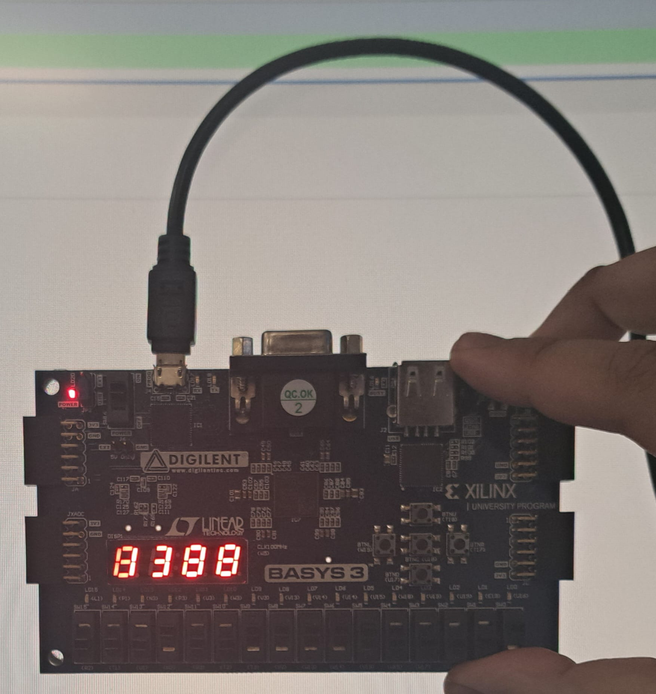
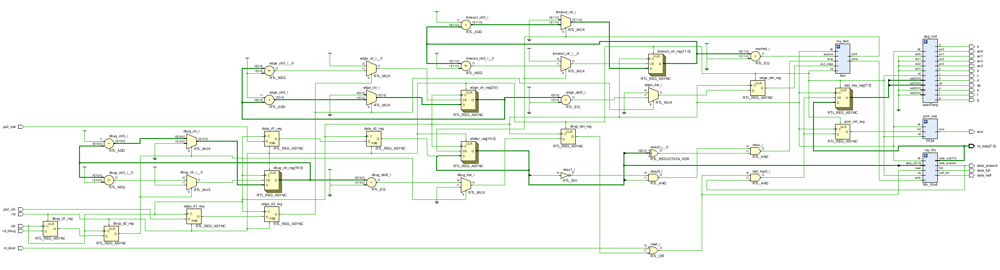
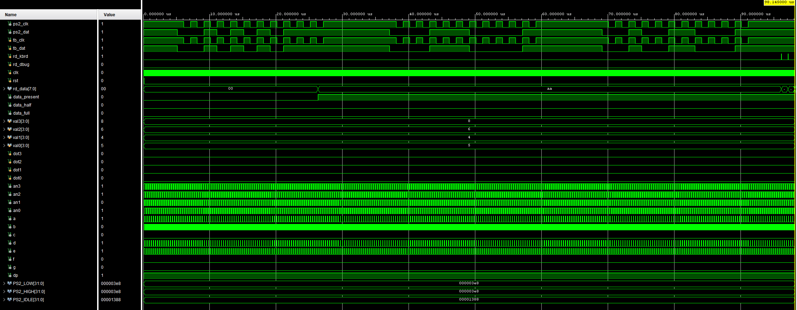
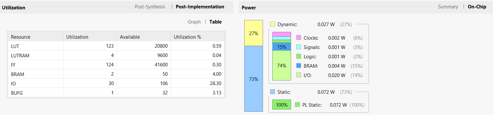

# FPGA PS/2 Keyboard Host Controller

Verilog FPGA project implementing PS/2 keyboard scan-code reception, FIFO buffering, four-digit seven-segment display output, and PCM audio-feedback integration on a Digilent Basys-3 FPGA board.

The project was implemented and tested in Xilinx Vivado. It combines a PS/2 receiver, scan-code storage, display logic, and an audio extension within a single FPGA design.

> This repository contains my original RTL, top-level integration, constraints, testbench work, and implementation evidence. Two course-provided support files, `DAC.v` and `ROM.v`, are intentionally excluded and are required only for the audio-feedback extension.



## Features

* PS/2 keyboard clock and data reception
* Serial scan-code capture
* FIFO buffering for received key data
* Four-digit seven-segment display output
* FPGA implementation on the Basys-3 Artix-7 platform
* PCM audio-feedback integration
* Original simulation testbench work
* Vivado RTL synthesis, implementation, and hardware demonstration

## Architecture

The design integrates the following main functions:

* PS/2 input synchronisation and edge detection
* Serial PS/2 frame capture
* Scan-code storage through FIFO logic
* Read control for keyboard data
* Four-digit seven-segment display decoding
* PCM sequence and audio-feedback integration



## Repository structure

```text
fpga-ps2-keyboard-host-controller/
├── rtl/
│   ├── FSM.v
│   ├── keyboard.v
│   ├── fifo_16x8.v
│   ├── quad7seg.v
│   ├── PCM.v
│   └── SEQ.v
├── tb/
│   └── Original PS/2 keyboard testbench
├── constraints/
│   └── keyboard.xdc
├── assets/
│   ├── vivado-rtl-schematic.png
│   ├── ps2-keyboard-simulation-waveform.png
│   ├── basys3-hardware-demo.jpg
│   └── post-implementation-utilization.png
└── README.md
```

## Verification

The original simulation testbench exercises PS/2 clock and data activity and verifies scan-code reception through the integrated design.



The waveform demonstrates PS/2 serial activity and captured keyboard scan-code data within the simulation environment.

## Hardware demonstration

The completed design was implemented on a Digilent Basys-3 FPGA board. The board photograph shows the PS/2 keyboard connection and active four-digit seven-segment display output.


## Implementation results

Post-implementation Vivado results show that the design used:

| Resource   | Used | Available | Utilisation |
| ---------- | ---: | --------: | ----------: |
| LUT        |  123 |    20,800 |       0.59% |
| LUTRAM     |    4 |     9,600 |       0.04% |
| Flip-flops |  124 |    41,600 |       0.30% |
| BRAM       |    2 |        50 |       4.00% |
| I/O        |   30 |       106 |      28.30% |
| BUFG       |    1 |        32 |       3.13% |



## Toolchain

* Xilinx Vivado
* Verilog HDL
* Digilent Basys-3 FPGA board
* PS/2 keyboard interface

## Important source-code note

The following files are not included because they were supplied through course material:

* `DAC.v`
* `ROM.v`

They are required for the complete PCM audio-feedback path. The remaining original files in this repository document my PS/2 controller, FIFO integration, display logic, state-machine work, PCM integration, constraints, and simulation effort.

## Scope

This repository is published as a portfolio record of the implemented FPGA project. It does not include Vivado-generated folders, bitstreams, cache files, course manuals, or instructor-provided support modules.
